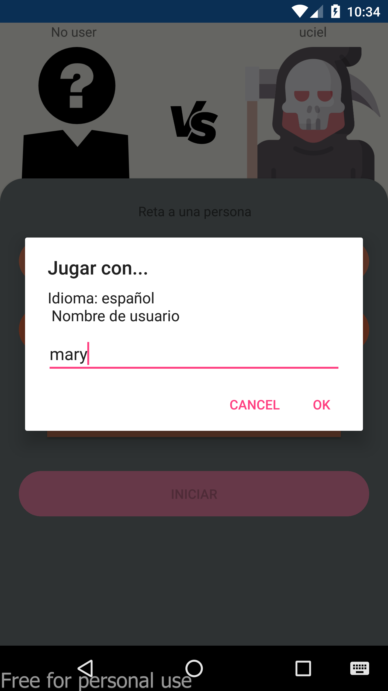

# questiongame
<h2>juego de preguntas</h2> 

En este proyecto se usó:

* xamarin
* azure funtion 
* azure storage
* azure signal R
* FreshMVVM

## Screens ##
 
  

## como correr el ejemplo ##
1. clone el repositorio 
2. en el proyecto de "Funtions":
 En el archivo "local.settings.json" colocar tus licencias de azure  
 
 {  
  "IsEncrypted": false,  
  "Values": {   
    "AzureWebJobsStorage": "UseDevelopmentStorage=true",   
    "FUNCTIONS_WORKER_RUNTIME": "dotnet",  
    "AzureSignalRConnectionString": "coloca tu endpoint",   
    "StorageConection": "coloca tu endpoint"   
  }   
}   

3. El en proyecto "QuestionService":   
coloque la url o endpoint base de azure funtion, si es de azure tiene que publicar primero las funtions y lo je ejecuta local solo copie el endpoint base    
 public class Config 
    {
        static readonly string Base = "url de tu azure funtion"; 

        public static string InitEndPointd = $"{Base}/Negotiate";
        public static string SyncUsersEndpoind = $"{Base}/SyncUsers";
        public static string SignInEndpoind = $"{Base}/SignIn";
        public static string SearchUserEndpoind = $"{Base}/User";
        public static string InitGameEndpoind = $"{Base}/initGame";
        public static string NextQuestionEndpoind = $"{Base}/next";
        public static string UserStateEnpoind = $"{Base}/UserState";
    }

